# Tonequill

Experimental acoustic modem and file-transfer system using commodity speakers and microphones, written in Rust.

Tonequill sends binary data through ordinary speakers and microphones without
Wi-Fi, Bluetooth, cloud services, or another data transport.

The project began as an ideal BFSK loopback, then evolved into a measured receiver
for real speaker-to-microphone recordings and a complete file-transfer stack with
frame CRCs and end-to-end file verification.

## Current status

- Robust acoustic BFSK PHY: working
- Physical speaker → air → microphone: validated
- Multi-packet file transfer: working
- Live one-way reception: validated
- Desktop application: implemented
- Reliable duplex protocol: software-tested
- Physical duplex: not yet validated
- Current PHY throughput: ~100 bit/s
- High-speed PHY: future work

| Capability | Validation level |
| --- | --- |
| Offline modulation, decoding, fragmentation, and reassembly | Software-validated |
| Phone speaker → air → PC microphone → live receive | Physically validated |
| Tauri desktop application | Implemented and software-tested; physical desktop validation is still in progress |
| Reliable duplex with selective retransmission | Software-tested |
| Reliable duplex over two physical endpoints | Not yet validated |

## What it does

```text
file → metadata and packets → BFSK waveform → speaker → air → microphone
     → acquisition and demodulation → CRC32 → reassembly → SHA-256 → recovered file
```

Each packet is independently framed and reacquired. The receiver scans recordings
or live microphone samples, estimates carrier balance and clock mismatch, follows
symbol timing, and exposes data only after a valid frame CRC. File output is
committed only when every packet is present and the final SHA-256 matches.

## Features

- Phase-continuous audible BFSK at 1200 Hz and 2200 Hz
- Preamble/sync acquisition across arbitrary leading audio
- Carrier calibration, clock estimation, fractional timing recovery, and soft decisions
- Bounded streaming frame scanner for long recordings and live input
- Versioned packet framing with sequence numbers, length bounds, and CRC32
- Binary-safe multi-packet transfer with SHA-256 verification
- CPAL-based live audio and phone-to-PC one-way receive
- Software-tested half-duplex status, selective retransmission, and completion protocol
- Deterministic channel simulation for noise, gain, clock mismatch, and echoes
- CLI diagnostics with carrier power, confidence, BER, and frame-level CSV output
- Tauri 2 desktop application using the same Rust live-audio service as the CLI

## Physical validation

Physical tests have completed this path on commodity hardware:

```text
phone playback → phone speaker → room air → PC microphone → CPAL receiver
→ packet reconstruction → SHA-256-verified output
```

Validated examples include the frozen 17-byte `physical-hello-v0.txt` fixture and
a 257-byte binary file split across two data packets. The 257-byte result required
replay during the session, so it establishes end-to-end correctness rather than a
universal one-pass packet success rate. Short-range behavior was tested in one
indoor environment; range and hardware variability have not been characterized
comprehensively.

Reliable duplex/ARQ is implemented and software-tested, but physical duplex
validation requires two Tonequill-capable endpoints and has not yet been completed.
Physical validation through the desktop UI is also still in progress. See
[physical validation](docs/physical-validation.md) and the detailed
[receiver investigation](docs/phone-pc-physical-investigation.md).

## Architecture

```mermaid
flowchart LR
    A[File] --> B[Transfer metadata<br/>and fragmentation]
    B --> C[Packet framing<br/>and CRC32]
    C --> D[Phase-continuous<br/>BFSK modulator]
    D --> E[Speaker]
    E --> F[Acoustic channel]
    F --> G[Microphone]
    G --> H[Acquisition, calibration,<br/>timing and demodulation]
    H --> I[Streaming frame scanner]
    I --> J[Reassembly and<br/>SHA-256 verification]
    J --> K[Recovered file]
```



The workspace keeps signal processing and protocol logic separate from audio and
application code:

| Path | Responsibility |
| --- | --- |
| `crates/tonequill-core` | PHY, framing, transfer protocol, simulation, reassembly |
| `crates/tonequill-live` | CPAL audio, live sessions, diagnostics, application service |
| `crates/tonequill-cli` | WAV/CLI workflows and evaluation commands |
| `apps/desktop` | Tauri 2, React, and TypeScript desktop application |
| `lab` | Reproducible measurement scripts |
| `docs` | Design, validation, and dependency notes |
| `test-vectors` | Small deterministic public fixtures |

## Desktop application

The desktop UI supports send/receive setup, audio-device selection, packet progress,
cancellation, diagnostics, safe destination selection, and verified completion.
Reliable duplex controls are explicitly experimental.

The UI invokes typed Tauri commands backed by `tonequill-live`; it does not shell
out to the CLI or duplicate the modem protocol in TypeScript.

The desktop bundle identifier is `local.tonequill.desktop`, a neutral local
application namespace that does not claim ownership of an Internet domain.

## Prerequisites

Windows is the currently tested development and live-audio platform. A source build
requires:

- the Rust MSVC toolchain with Cargo, rustfmt, and Clippy;
- Node.js 24 and npm;
- Microsoft C++ Build Tools with **Desktop development with C++**;
- Microsoft Edge WebView2 for the Tauri desktop application.

The core algorithms are platform-independent Rust, and CPAL/Tauri support other
platforms, but this repository does not claim tested macOS or Linux live-audio
behavior. See the official [Tauri prerequisites](https://v2.tauri.app/start/prerequisites/)
for platform details.

## Quick start

Clone the repository, then build the Rust workspace:

```powershell
cargo build --release
```

Create a deterministic transfer WAV and decode it back to a file:

```powershell
New-Item -ItemType Directory -Force target/demo | Out-Null
cargo run --release -p tonequill-cli -- encode test-vectors/hello.txt target/demo/hello.wav
cargo run --release -p tonequill-cli -- decode target/demo/hello.wav target/demo/recovered.txt
Compare-Object (Get-Content test-vectors/hello.txt) (Get-Content target/demo/recovered.txt)
```

List and check live audio devices:

```powershell
cargo run --release -p tonequill-cli -- audio-devices
cargo run --release -p tonequill-cli -- audio-check --input-device 0 --output-device 1 --seconds 3
```

For phone-to-PC receive, copy `target/demo/hello.wav` to the phone, start the
receiver, and play the complete WAV:

```powershell
cargo run --release -p tonequill-cli -- receive target/demo/received.txt --one-way --input-device 0 --idle-timeout 120
```

Device indices are examples. Use the indices or stable IDs printed by
`audio-devices`. The destination directory must already exist. The receiver exits
successfully only after final SHA-256 verification; replaying the same WAV during
an incomplete one-way session can supply a packet that failed on an earlier pass.

Install frontend dependencies and run the desktop application:

```powershell
npm --prefix apps/desktop ci
npm --prefix apps/desktop run desktop
```

Build the Windows NSIS installer:

```powershell
npm --prefix apps/desktop run bundle
```

Generated executables and installers belong in GitHub Releases, not in the source
tree.

## Protocol profile

The current compatibility profile, informally called **Robust100**, uses:

| Parameter | Value |
| --- | --- |
| Sample rate | 48 kHz, mono |
| Modulation | Binary FSK |
| Bit 0 / bit 1 | 1200 Hz / 2200 Hz |
| Symbol duration | 10 ms, 480 samples |
| Raw bitrate | 100 bit/s |
| Modulator amplitude | 0.55 |
| Maximum packet payload | 256 bytes |
| Frame integrity | CRC32 |
| Whole-file integrity | SHA-256 |

Frames carry an 8-byte preamble, a 16-bit sync word, protocol version, frame kind,
transfer ID, sequence number, payload length, payload, and CRC32. File metadata
includes bounded filename information, byte count, data-packet count, and SHA-256.
Only the destination selected by the receiver is used for output. See the
[file-transfer design](docs/file-transfer.md).

The Tonequill rename does not change the wire format. The existing `SLTF` file
metadata magic and `SLAR` reliable-control magic remain unchanged so recordings
and peers using protocol version 1 stay compatible.

## Performance and limitations

Robust100 intentionally favors acquisition and integrity over throughput. Raw
throughput is about 100 bit/s and useful file throughput is lower after preambles,
headers, CRCs, metadata, guard intervals, and optional feedback. A 17-byte one-way
transfer WAV is approximately 10.5 seconds.

Current limitations:

- audible tones and low throughput;
- variable performance across speakers, microphones, rooms, and audio processing;
- no comprehensive range or packet-error-rate study across multiple devices;
- no physical validation of the duplex feedback path;
- no encryption, authentication, or peer identity;
- CRC32 and SHA-256 protect integrity, not confidentiality or authenticity;
- diagnostic microphone recordings may contain environmental audio and are kept private.

A higher-throughput PHY is future work. Robust100 should remain available as a
compatibility and measurement profile.

## Testing

Default Rust quality gates do not require audio hardware:

```powershell
cargo fmt --check
cargo check --workspace
cargo test --workspace
cargo clippy --workspace --all-targets -- -D warnings
```

Frontend gates:

```powershell
npm --prefix apps/desktop ci
npm --prefix apps/desktop run contracts:check
npm --prefix apps/desktop run format:check
npm --prefix apps/desktop run typecheck
npm --prefix apps/desktop run lint
npm --prefix apps/desktop test
npm --prefix apps/desktop run build
```

Ignored Rust tests include longer sweeps, large WAV transfers, and optional private
physical-capture regressions. Run all practical software-only ignored tests in a
release build with:

```powershell
cargo test --release --workspace -- --ignored
```

See the [receiver engineering report](docs/receiver-engineering-report.md) and
[dependency audit](docs/dependencies.md).

## Roadmap

Development is paused at this public checkpoint. If it resumes:

1. finish desktop physical validation;
2. physically validate duplex with two Tonequill-capable devices;
3. investigate a higher-throughput PHY;
4. preserve Robust100 as the compatibility profile.

See [next steps](docs/next-steps.md).

## Contributing and security

See [CONTRIBUTING.md](CONTRIBUTING.md) for the expected checks and
[SECURITY.md](SECURITY.md) for private vulnerability reporting guidance.

## License

Tonequill is available under the [MIT License](LICENSE).
